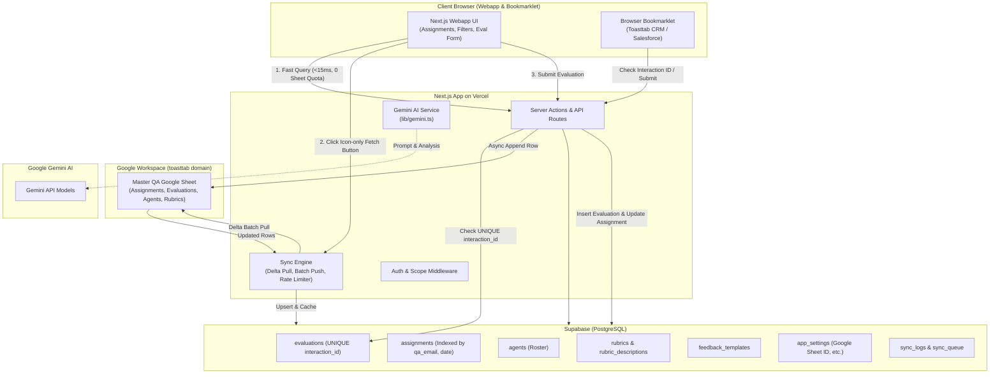

# Personal QA & Productivity Tracker: Architecture & Implementation Plan

## 1. Executive Summary & Goal Description

This project is a high-performance **Personal QA Productivity Tracker** built with **Next.js (App Router, TypeScript, Tailwind CSS)**, **Supabase (PostgreSQL & Auth)**, deployed on **Vercel**, and seamlessly integrated with an internal **Google Sheet** (hosted in the `toasttab` domain).

### Core Problem & Key Objectives
1. **Google Sheet Quota & Rate Limit Protection**:
   The master Google Sheet contains large volumes of historical and team-wide data (Agents, Assignments, Evaluations, Rubrics, Templates, Settings). Direct querying from the webapp on page loads or filter changes would quickly deplete Google's API quotas (60–300 requests/min) and cause slow page loads.
   *Solution*: Supabase serves as a high-speed transactional database and synchronization cache. All UI queries run against Supabase in milliseconds with **zero Google Sheet quota consumption**. Syncing is handled via smart delta pulls, batch operations, and a dedicated icon-only fetch action.

2. **Scoped Assignments for Logged-In QA**:
   The webapp identifies the logged-in QA user (by their authenticated email, e.g., `@toasttab.com`) and pulls all their personal assignments into an intuitive, high-speed interface.

3. **Global Interaction ID Uniqueness & Duplicate Prevention**:
   When entering an evaluation entry, `Interaction ID` **must be unique across all QA users** (past and present). The system caches all team evaluations in Supabase and runs real-time duplicate checks as the user types, blocking submissions if an interaction was already audited by anyone.

4. **Dynamic Date Filtering & Navigation**:
   The assignments table provides seamless switching between `Day`, `Week`, and `Month` views, with strict date formatting:
   - **Day View**: `"Mon, Sep 28, 2026"` (`EEE, MMM d, yyyy`)
   - **Week View**: `"WE 10.04.2026"` (Week Ending format `WE MM.dd.yyyy`, where the week runs Monday to Sunday and the date displayed is the Sunday ending date)
   - **Month View**: `"September 2026"` (`MMMM yyyy`)

5. **Icon-Only Fetch Action**:
   A clean, icon-only button (no text) to trigger on-demand synchronization with the Google Sheet, equipped with loading animations and cooldown safeguards.

6. **Webapp Settings**:
   A dedicated Settings page where the user can enter and update the **Google Sheet ID**, configure credentials, manage sync thresholds, and test sheet connectivity.

7. **Extensibility for Bookmarklet & Gemini AI**:
   - **Bookmarklet Ready**: CORS-enabled, lightweight JSON endpoints for instant interaction checks and remote evaluations.
   - **Gemini AI Ready**: Modular AI client service (`lib/gemini.ts`), configurable model list (`gemini-2.5-flash`, `gemini-1.5-pro`, `gemini-3.6-flash`), and UI extension slots for Case Note audits and feedback generation.

---

## 2. System Architecture & Data Flow



---

## 3. Google Sheet Quota Management & Sync Strategy

### The Quota Challenge
- Google Sheets API v4 enforces limits of **300 read requests per minute** per project and **60 read requests per minute** per user.
- Evaluating interactions occurs continuously throughout the day; querying the sheet directly for every navigation click, search keystroke, or page refresh will cause HTTP 429 throttling and freeze the app.

### The Recommended Sync Architecture
1. **Cache-First (Zero Quota for Reads)**:
   - All client reads query Supabase directly. Supabase PostgreSQL handles date filtering, sorting, user scoping, and pagination in milliseconds.
2. **Delta & Batch Pulling (Minimal Quota for Sync)**:
   - When the user clicks the **Fetch button**:
     - The sync service reads the `sync_logs` table to find the `last_synced_at` timestamp and highest row index.
     - For `Assignments`: Fetches only new/modified rows or queries the active sheet range.
     - For `Evaluations`: Fetches newly appended rows (`A{lastRow+1}:Z`) from all other QA evaluators and bulk-upserts them into Supabase.
     - For `Agents`, `Rubrics`, `Templates`: Only pulled if modified or during a full refresh.
3. **Fetch Button Safeguards**:
   - Icon-only button (`<RefreshCw />` from Lucide).
   - Visual state: Spins during sync, disables multiple rapid clicks (cooldown interval of 30 seconds).
   - Tooltip indicating "Sync with Google Sheet" and last synced time (e.g. "Last synced 3m ago").
4. **Resilient Two-Phase Submission for New Evaluations**:
   - **Step 1 (Immediate local persistence)**: Check Supabase for `interaction_id` uniqueness. If unique, write the evaluation to Supabase immediately and mark assignment as `Completed`.
   - **Step 2 (Sheet Append)**: Append the new evaluation row to Google Sheets `Evaluations` tab and update the assignment status in `Assignments`.
   - **Step 3 (Offline / Retry Queue)**: If Google Sheets API is temporarily unavailable or rate-limited, the evaluation remains safely committed in Supabase and marked in `sync_queue` for automatic background retry.
5. **Authentication with Domain-Restricted Google Sheet**:
   - Since the sheet is hosted within the `toasttab` domain:
     - **Option 1 (Google Workspace Service Account)**: A Google Cloud Service Account shared with Viewer/Editor access to the sheet.
     - **Option 2 (Google OAuth 2.0)**: User signs in with their `@toasttab.com` Google account, granting the `https://www.googleapis.com/auth/spreadsheets` scope. The user's OAuth access token is refreshed automatically.
     - The settings UI will support both options seamlessly.

---

## 4. Supabase Database Schema

The database schema directly maps to the provided CSV files while enforcing relational constraints and indexes.

```sql
-- 1. Profiles (linked to Supabase Auth)
CREATE TABLE IF NOT EXISTS profiles (
    id UUID PRIMARY KEY REFERENCES auth.users(id) ON DELETE CASCADE,
    email TEXT UNIQUE NOT NULL,
    full_name TEXT,
    role TEXT DEFAULT 'QA Evaluator',
    created_at TIMESTAMPTZ DEFAULT NOW(),
    updated_at TIMESTAMPTZ DEFAULT NOW()
);

-- 2. App & User Settings
CREATE TABLE IF NOT EXISTS app_settings (
    id UUID PRIMARY KEY DEFAULT gen_random_uuid(),
    user_id UUID REFERENCES auth.users(id) ON DELETE CASCADE,
    google_sheet_id TEXT NOT NULL,
    sheet_name_assignments TEXT DEFAULT 'Assignments',
    sheet_name_evaluations TEXT DEFAULT 'Evaluations',
    sheet_name_agents TEXT DEFAULT 'Agents',
    sheet_name_rubrics TEXT DEFAULT 'Rubrics',
    sheet_name_templates TEXT DEFAULT 'FeedbackTemplates',
    sheet_name_rubric_desc TEXT DEFAULT 'RubricDescriptions',
    sync_interval_seconds INT DEFAULT 180,
    gemini_api_key TEXT,
    gemini_model TEXT DEFAULT 'gemini-2.5-flash',
    created_at TIMESTAMPTZ DEFAULT NOW(),
    updated_at TIMESTAMPTZ DEFAULT NOW(),
    UNIQUE(user_id)
);

-- 3. Agents Roster
CREATE TABLE IF NOT EXISTS agents (
    eid TEXT PRIMARY KEY,
    case_safe_id TEXT,
    toasttab_email TEXT,
    internal_ibex_email TEXT,
    full_name TEXT NOT NULL,
    display_name TEXT,
    location TEXT,
    skill TEXT,
    channel TEXT,
    tier TEXT,
    role TEXT,
    status TEXT DEFAULT 'Active',
    wave TEXT,
    production_date DATE,
    supervisor TEXT,
    manager TEXT,
    created_at TIMESTAMPTZ,
    synced_at TIMESTAMPTZ DEFAULT NOW()
);

-- 4. Rubrics
CREATE TABLE IF NOT EXISTS rubrics (
    id TEXT PRIMARY KEY, -- e.g. 'RB-2002'
    name TEXT NOT NULL,
    structure JSONB NOT NULL,
    version INT DEFAULT 1,
    status TEXT DEFAULT 'Active',
    is_default BOOLEAN DEFAULT FALSE,
    created_at TIMESTAMPTZ,
    synced_at TIMESTAMPTZ DEFAULT NOW()
);

-- 5. Rubric Descriptions & Guidelines
CREATE TABLE IF NOT EXISTS rubric_descriptions (
    id TEXT PRIMARY KEY, -- e.g. 'RD-5001'
    rubric_id TEXT REFERENCES rubrics(id) ON DELETE CASCADE,
    section_index INT NOT NULL,
    item_index INT NOT NULL,
    option_index INT NOT NULL,
    description JSONB NOT NULL,
    synced_at TIMESTAMPTZ DEFAULT NOW()
);

-- 6. Feedback Templates
CREATE TABLE IF NOT EXISTS feedback_templates (
    id TEXT PRIMARY KEY, -- e.g. 'FT-1001'
    created_by TEXT,
    rubric_id TEXT REFERENCES rubrics(id) ON DELETE CASCADE,
    section_index INT NOT NULL,
    item_index INT NOT NULL,
    option_index INT NOT NULL,
    button_label TEXT,
    feedback_text TEXT NOT NULL,
    created_at TIMESTAMPTZ,
    updated_at TIMESTAMPTZ,
    synced_at TIMESTAMPTZ DEFAULT NOW()
);

-- 7. Assignments (Scoped to QA Email)
CREATE TABLE IF NOT EXISTS assignments (
    id TEXT PRIMARY KEY, -- e.g. 'ASG-1788020018735-8529'
    date DATE NOT NULL,
    qa_email TEXT NOT NULL,
    agent_email TEXT NOT NULL,
    agent_snapshot JSONB NOT NULL,
    rubric_id TEXT REFERENCES rubrics(id),
    status TEXT NOT NULL DEFAULT 'Pending', -- 'Pending', 'Partial', 'Completed'
    swap_data JSONB,
    assigned_by TEXT,
    evaluation_type TEXT,
    timestamp TIMESTAMPTZ,
    synced_at TIMESTAMPTZ DEFAULT NOW()
);

CREATE INDEX IF NOT EXISTS idx_assignments_qa_date ON assignments(qa_email, date);
CREATE INDEX IF NOT EXISTS idx_assignments_status ON assignments(status);

-- 8. Evaluations (GLOBAL UNIQUE interaction_id)
CREATE TABLE IF NOT EXISTS evaluations (
    id TEXT PRIMARY KEY, -- e.g. 'EVL-1788027719899-657'
    submitted_at TIMESTAMPTZ NOT NULL DEFAULT NOW(),
    agent_name TEXT NOT NULL,
    agent_snapshot JSONB NOT NULL,
    score NUMERIC(5, 2) NOT NULL,
    shift_snapshot TEXT,
    rubric_id TEXT REFERENCES rubrics(id),
    evaluation_details JSONB NOT NULL,
    assignment_id TEXT REFERENCES assignments(id),
    interaction_id TEXT UNIQUE NOT NULL, -- CRUCIAL: Global uniqueness!
    date_of_interaction DATE,
    call_ani_dnis TEXT,
    case_no TEXT,
    call_duration TEXT,
    case_category TEXT,
    case_sub_category TEXT,
    issue_concern TEXT,
    qa_name TEXT NOT NULL,
    qa_email TEXT,
    dispute_status TEXT DEFAULT 'None',
    dispute_data JSONB,
    evaluation_type TEXT,
    consultation_status TEXT DEFAULT 'None',
    consultation_data JSONB,
    comments TEXT,
    ticket_link TEXT,
    supervisor_ack_status TEXT DEFAULT 'None',
    supervisor_ack_data JSONB,
    sync_status TEXT DEFAULT 'synced', -- 'synced', 'pending_sheet_sync', 'failed'
    synced_at TIMESTAMPTZ DEFAULT NOW()
);

-- Fast lookup for interaction_id uniqueness pre-checks
CREATE UNIQUE INDEX IF NOT EXISTS idx_evaluations_interaction_id ON evaluations(interaction_id);
CREATE INDEX IF NOT EXISTS idx_evaluations_qa_email ON evaluations(qa_email);
CREATE INDEX IF NOT EXISTS idx_evaluations_case_no ON evaluations(case_no);

-- 9. Sync Logs & Delta Tracker
CREATE TABLE IF NOT EXISTS sync_logs (
    id UUID PRIMARY KEY DEFAULT gen_random_uuid(),
    user_id UUID REFERENCES auth.users(id),
    target_table TEXT NOT NULL,
    rows_synced INT DEFAULT 0,
    status TEXT NOT NULL, -- 'success', 'partial', 'error'
    error_message TEXT,
    last_row_index INT,
    started_at TIMESTAMPTZ DEFAULT NOW(),
    completed_at TIMESTAMPTZ
);
```

---

## 5. Assignments Page UI & Date Navigation Logic

### View Filter Tabs
The top of the Assignments view provides three mode toggles:
- **`[ Day ]`**
- **`[ Week ]`**
- **`[ Month ]`**

### Date Navigation Bar & Dynamic Formats
Between the Previous (`<`) and Next (`>`) arrows, the central header displays the formatted date range:
1. **Day Navigation**:
   - Format: `"Mon, Sep 28, 2026"` (`format(currentDate, "EEE, MMM d, yyyy")`)
   - Moving `<` / `>` shifts by `±1 day`.
   - Clicking "Today" resets to `currentDate`.
2. **Week Navigation**:
   - Week runs **Monday to Sunday**.
   - Format: `"WE 10.04.2026"` (Week Ending `WE MM.dd.yyyy`, where the date is the Sunday at the end of that week).
   - Moving `<` / `>` shifts by `±7 days`.
   - Calculation:
     ```typescript
     function getWeekEndingDisplay(date: Date): string {
       // Monday is start (1), Sunday is end (7)
       const endOfWeekSunday = endOfWeek(date, { weekStartsOn: 1 });
       return `WE ${format(endOfWeekSunday, 'MM.dd.yyyy')}`;
     }
     ```
3. **Month Navigation**:
   - Format: `"September 2026"` (`format(currentDate, "MMMM yyyy")`)
   - Moving `<` / `>` shifts by `±1 month`.

### Icon-Only Fetch Button
Positioned cleanly in the header next to the navigation bar:
```tsx
<button
  onClick={handleFetchSync}
  disabled={isSyncing || cooldownActive}
  title={isSyncing ? "Syncing..." : "Sync with Google Sheet"}
  aria-label="Sync with Google Sheet"
  className="p-2 rounded-lg border border-border hover:bg-accent transition-colors disabled:opacity-50"
>
  <RefreshCw className={`h-4 w-4 ${isSyncing ? "animate-spin text-primary" : "text-foreground"}`} />
</button>
```

### Assignments Table Columns
- **Status Badge**: `Pending` (amber), `Partial` (blue), `Completed` (green).
- **Date**: Formatted assignment date.
- **Agent**: Display Name / Full Name with location and skill badges.
- **Channel & Skill**: e.g., Voice / POS Kitchen, Chat / Back Office.
- **Evaluation Type**: e.g., Manual Audit, Validation Review.
- **Rubric**: Rubric ID & Name (e.g., RB-2002).
- **Actions**: "Start Evaluation" or "Edit Evaluation" button leading to the Evaluation Entry form.

---

## 6. Interaction ID Uniqueness & Evaluation Entry Workflow

### Duplicate Interaction ID Prevention
1. **Real-Time Client-Side Debounced Pre-Check**:
   - When the QA evaluator enters an Interaction ID into the form, a debounced check triggers:
     `GET /api/evaluations/check-interaction?id=${encodeURIComponent(interactionId)}`
   - If found in Supabase (regardless of which QA auditor submitted it):
     - Display a warning callout:
       > ⚠️ **Interaction ID Already Evaluated!**
       > This Interaction ID (`300000013637708`) was already evaluated on **Aug 19, 2026** by **Justin Surio** for Case **#19314895**. Score: **85.0%**. Duplicate submissions are blocked.
     - Disable the Submit and Draft buttons.
2. **Form Validation Enforcement**:
   - Following user requirements and lessons learned, all mandatory fields (Interaction ID, Date of Interaction, Case No., Call Duration, Rubric options) trigger native browser and custom form validation (`form.reportValidity()`) before allowing submission or draft saving.
3. **Database Guard**:
   - The PostgreSQL constraint `UNIQUE(interaction_id)` guarantees that even concurrent submissions cannot create duplicate entries.

---

## 7. Webapp Settings Page

The Settings view (`/settings`) contains:
1. **Google Sheet Configuration**:
   - **Google Sheet ID**: Input field with regex parsing (extracts the 44-character ID from a full Google Sheets URL or raw ID).
   - **Sheet Tabs Configuration**: Pre-populated defaults (`Assignments`, `Evaluations`, `Agents`, `Rubrics`, `FeedbackTemplates`, `RubricDescriptions`, `Settings`).
   - **Connection Tester**: A "Test Connection" button that validates API connectivity and verifies that required tabs and header columns are present.
2. **Sync Settings**:
   - Cooldown timer for the manual fetch button (default: 30 seconds).
   - Auto-sync interval toggle.
   - Sync statistics: Total assignments cached, total evaluations cached, last sync status.
3. **Gemini AI Settings (Readiness)**:
   - Gemini API Key field (stored securely).
   - Model selection dropdown: `gemini-2.5-flash`, `gemini-1.5-pro`, `gemini-3.6-flash`, `gemini-2.5-pro`.
   - Feature flags for AI Case Notes checker and feedback assistant.

---

## 8. Extensibility: Bookmarklet & Gemini AI Architecture

### 1. Bookmarklet Readiness
- **Endpoint**: `/api/evaluations/check-interaction` and `/api/evaluations/quick-submit`.
- **CORS Support**: Configured in `next.config.ts` or route handlers to permit requests from Salesforce / CRM origins (`*.force.com`, `*.toasttab.com`).
- **Token Auth**: API Token generation in user settings for the bookmarklet to authenticate without requiring full session cookies.

### 2. Gemini AI Readiness
- Dedicated module `@/lib/gemini.ts` using `@google/genai` or `@google/generative-ai`.
- Stub routes ready for activation:
  - `/api/ai/case-notes-checker`: Audit case documentation formatting against rubric criteria (addressing the known past issue: ensuring proper `.select()` calls on Supabase queries).
  - `/api/ai/generate-feedback`: Generate structured coaching feedback based on selected rubric scores.

---

## 9. Proposed Project Structure

```
personal-qa-tracker/
├── app/
│   ├── (auth)/
│   │   ├── login/
│   │   │   └── page.tsx
│   │   └── layout.tsx
│   ├── (dashboard)/
│   │   ├── assignments/
│   │   │   ├── page.tsx               # Main assignments list with Day/Week/Month navigation
│   │   │   └── [id]/
│   │   │       └── evaluate/
│   │   │           └── page.tsx       # Evaluation scoring & entry form
│   │   ├── settings/
│   │   │   └── page.tsx               # Google Sheet ID & system settings
│   │   ├── layout.tsx                 # Header, sidebar, user profile
│   │   └── page.tsx                   # Redirect or productivity dashboard
│   ├── api/
│   │   ├── sync/
│   │   │   └── route.ts               # Google Sheet sync engine (pull/push)
│   │   ├── evaluations/
│   │   │   ├── route.ts               # Create evaluation, query evaluations
│   │   │   └── check-interaction/
│   │   │       └── route.ts           # Instant Interaction ID uniqueness pre-check
│   │   └── ai/
│   │       └── route.ts               # Gemini AI readiness endpoint
│   ├── globals.css
│   └── layout.tsx
├── components/
│   ├── assignments/
│   │   ├── date-navigation.tsx        # Day ("Mon, Sep 28, 2026"), Week ("WE 10.04.2026"), Month ("September 2026")
│   │   ├── assignments-table.tsx      # Table with status, agent, rubric, action
│   │   └── fetch-button.tsx           # Icon-only fetch button with spinner & cooldown
│   ├── evaluations/
│   │   ├── evaluation-form.tsx        # Scoring form, duplicate check, reportValidity()
│   │   ├── rubric-section.tsx         # Rubric questions, buttons/dropdowns, point tally
│   │   └── feedback-popover.tsx       # Canned feedback from feedback_templates
│   ├── settings/
│   │   ├── sheet-config-card.tsx      # Google Sheet ID & credentials
│   │   └── ai-config-card.tsx         # Gemini AI model & key settings
│   └── ui/                            # Reusable UI primitives (Button, Input, Badge, Dialog)
├── lib/
│   ├── google/
│   │   ├── sheets.ts                  # Google Sheets API client (OAuth / Service Account)
│   │   └── sync-service.ts            # Delta pull & batch append logic
│   ├── supabase/
│   │   ├── client.ts                  # Client-side Supabase client
│   │   ├── server.ts                  # Server-side Supabase client (cookies)
│   │   └── service.ts                 # Service-role client for admin sync tasks
│   ├── date-utils.ts                  # Week Ending (Monday-Sunday), Day, Month formatters
│   ├── gemini.ts                      # Gemini AI client wrapper
│   └── types.ts                       # TypeScript interfaces for all models
├── supabase/
│   └── migrations/
│       └── 001_initial_schema.sql     # Full SQL DDL with UNIQUE interaction_id
├── CSV/                               # Existing Google Sheet sample CSV files
├── public/
├── package.json
├── tsconfig.json
├── next.config.ts
└── plan.md                            # Permanent in-workspace plan reference
```

---

## 10. Implementation Roadmap & Phases

### Phase 1: Project Foundation & Supabase Setup
- Initialize Next.js 15 project with TypeScript, Tailwind CSS, and Lucide icons.
- Configure Supabase client (browser client, server client with `@supabase/ssr`).
- Create initial SQL migration (`001_initial_schema.sql`) with tables, indexes, and unique constraints.
- Seed database with existing CSV data (Agents, Rubrics, RubricDescriptions, FeedbackTemplates, Settings) to enable immediate local testing.

### Phase 2: Google Sheets Sync Engine (Quota Safe)
- Implement Google Sheets API v4 integration in `lib/google/sheets.ts`.
- Build the sync engine (`lib/google/sync-service.ts`):
  - Incremental pull for assignments and evaluations.
  - Rate limiting, debouncing, and delta timestamp tracking.
- Create `/api/sync` route and connect it to the icon-only Fetch button.

### Phase 3: Assignments Page & Date Navigation
- Build the Day/Week/Month toggle filter.
- Implement exact date navigation formatting:
  - Day: `"Mon, Sep 28, 2026"`
  - Week: `"WE 10.04.2026"` (Monday to Sunday, ending Sunday)
  - Month: `"September 2026"`
- Create the Assignments table displaying assignments scoped to the logged-in user's email.
- Embed the icon-only fetch button with spin animation and cooldown state.

### Phase 4: Evaluation Entry & Interaction ID Uniqueness
- Build the Evaluation form populated with the assignment's agent snapshot and rubric.
- Implement debounced Interaction ID duplicate check against all evaluations.
- Display duplicate conflict alert if the Interaction ID is already in the database.
- Enforce mandatory validation (`form.reportValidity()`) before submitting or drafting.
- Submit evaluation: commit to Supabase and append to Google Sheet.

### Phase 5: Settings Page
- Google Sheet ID input with validation and "Test Connection" tool.
- Cooldown and sync preferences.
- Sync history & cache statistics display.

### Phase 6: Bookmarklet & Gemini AI Readiness
- Provide `/api/evaluations/check-interaction` with CORS enabled for remote tools.
- Set up `@/lib/gemini.ts` with model selection and prompt templates.

---

## 11. Verification & Testing Plan

### Automated & Unit Tests
1. **Date Formatting Tests**:
   - Verify Day format: `Mon, Sep 28, 2026`.
   - Verify Week format: `WE 10.04.2026` for any date between Mon Sep 28 and Sun Oct 4, 2026.
   - Verify Month format: `September 2026`.
2. **Interaction ID Uniqueness Tests**:
   - Verify that an existing `interaction_id` triggers an immediate duplicate error.
   - Verify database-level rejection via `UNIQUE(interaction_id)` constraint.
3. **Form Validation Tests**:
   - Verify that submitting or drafting with empty mandatory fields triggers validation errors.

### Manual Verification Checklist
1. **Google Sheet Sync**:
   - Enter Google Sheet ID in Settings and test connection.
   - Click the icon-only fetch button; observe loading spinner and updated assignments count.
   - Confirm no unnecessary Google Sheet API calls occur during table filtering or tab navigation.
2. **Assignments Navigation**:
   - Switch between Day, Week, and Month filters; verify label formatting and assignment list scoping.
3. **Evaluation Submission**:
   - Open an assignment, test entering an already existing Interaction ID from the CSV dataset (`300000013637708`); confirm warning appears.
   - Enter a new unique Interaction ID, complete required rubric questions, submit; verify record is saved to Supabase and appended to Google Sheet.
